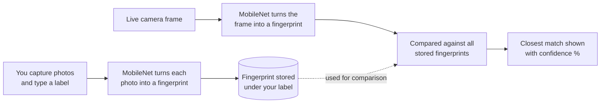
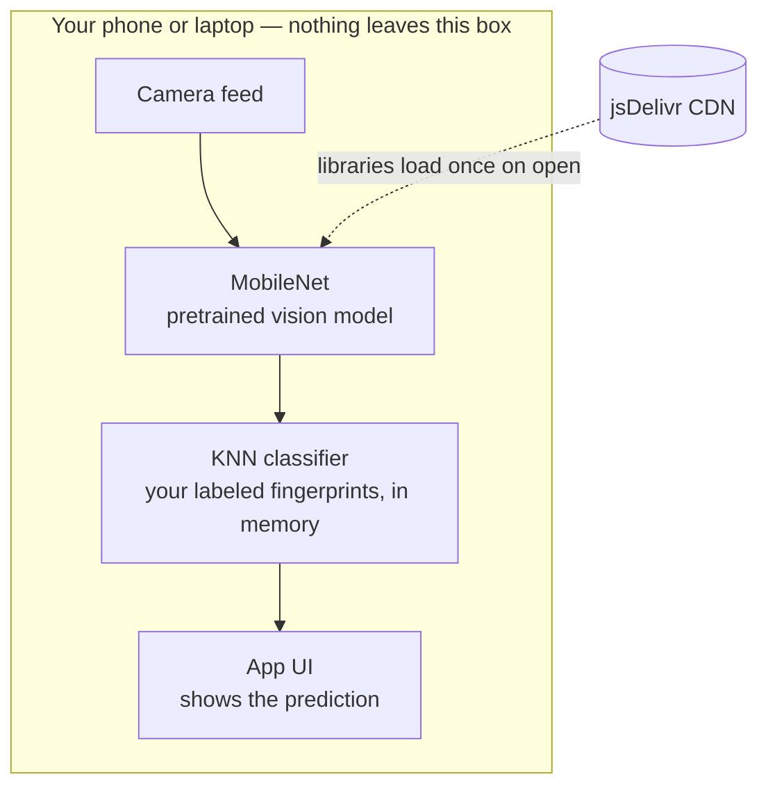

# My Vision — teach your camera to recognize your stuff

A self-contained, single-file web app that trains a live object recognizer using your phone or laptop camera. No installs, no accounts, no backend — everything runs in the browser.

## What it does

1. You show the camera an object and label it (e.g. "water bottle").
2. The app converts each photo into a numeric "fingerprint" using MobileNet, a pretrained vision model.
3. When you turn on recognition, it compares live camera frames to your saved fingerprints and shows the closest match with a confidence score.

Your photos never leave your device — nothing is uploaded anywhere.

## How it works

**Training** (top row): every photo you capture gets converted into a fingerprint and filed under its label.
**Recognizing** (bottom row): each live frame gets its own fingerprint, which is compared against everything you've stored — the closest match wins.

## Under the hood

The only thing that touches the network is the one-time library download when you open the page. Your camera feed, photos, and fingerprints all stay local to the browser tab.

## Files

- `object-recognizer.html` — the entire app (HTML, CSS, and JavaScript in one file).

## Important: hosting requirement

Browsers only allow camera access over a secure connection (`https://` or `localhost`). Opening the file directly (`file://...`) will work on most desktop browsers, but **will likely block the camera on mobile browsers**, especially iOS Safari.

To use it on your phone, host the file somewhere with `https://`. Two free, no-code options:

### Option A: Netlify Drop (fastest, no account needed)
1. Go to [app.netlify.com/drop](https://app.netlify.com/drop) on your laptop.
2. Drag `object-recognizer.html` into the browser window.
3. Netlify gives you a live `https://...netlify.app` link instantly.
4. Open that link on your phone.

### Option B: GitHub Pages (better if you'll keep editing it)
1. Create a free GitHub repository.
2. Upload the file and rename it to `index.html`.
3. Go to **Settings → Pages**, set the source to your main branch.
4. GitHub gives you a `https://yourusername.github.io/reponame` link within a minute or two.

## How to use it

1. Open the hosted link — allow camera access when prompted.
2. Wait a few seconds for "Loading vision model…" to finish.
3. Type a label in the text field (e.g. "coffee mug").
4. Press and hold **Hold to capture** while turning the object slightly — this grabs ~15-20 photo samples automatically. Aim for a few different angles and lighting if possible.
5. Repeat for at least one more label (the app needs 2+ labels before it can distinguish between them).
6. Tap **Start recognizing** and point the camera at an object — it will show its best guess and confidence.
7. Tap the flip icon (⟳) to switch between front and back camera.

## Tips for better accuracy

- Use a plain, consistent background while capturing so the model doesn't accidentally learn the background instead of the object.
- Add a "background" or "none of these" label with a few random empty-scene captures — this helps the app say "not sure" instead of forcing a guess when nothing trained is in frame.
- More examples per label (within reason) generally improves accuracy. 15-30 is a good range.
- If two labels look visually similar, capture from more distinct angles to help the model tell them apart.

## Saving and reloading your training data

Training data is **not** saved automatically between sessions (it lives in memory only, for privacy and simplicity). To keep it:

- Tap **Export training data** to download a `.json` file with everything you've taught it.
- Tap **Import training data** and select that file to reload it in a future session — this restores all labels and examples instantly, no retraining needed.

## Tech notes

- Built with [TensorFlow.js](https://www.tensorflow.org/js), the [MobileNet](https://github.com/tensorflow/tfjs-models/tree/master/mobilenet) pretrained model, and a [KNN classifier](https://github.com/tensorflow/tfjs-models/tree/master/knn-classifier) for matching.
- All three libraries load from a CDN (jsDelivr) on page load, so an internet connection is required at least once per session — but no data is sent out, only the libraries are fetched in.
- Everything after that (capturing, matching, predicting) runs fully on-device.
